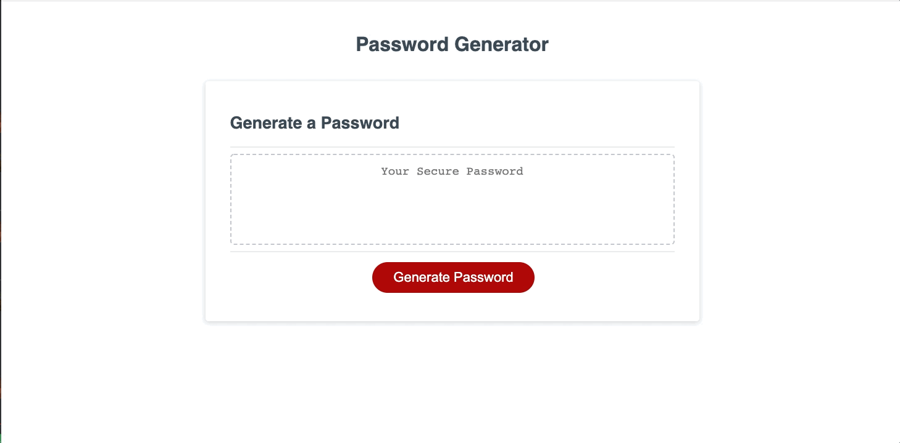

# Password Generator

## With this project I was tasked to create a password generator.  This password generator would give the user a unique password based on what the user wanted to be included,  e.g, Lowercase letters, Uppercase letters, Numbers, and Special characters.

### Things that i included in this Password Generator

1. Users will click the generate password button and they will be presented with options for their password.

2. There will be a prompt for a password length from 8 to 128 characters.

3. There will be a series of confirm boxes that ask the user if they would like lowercase letters, uppercase letters, numbers, and special characters.

4. When all prompts have been completed the user will get a password returned to them with least 1 character from each of the chosen criteria.

[gitHub pages](https://cefaust.github.io/Password-Generator/)